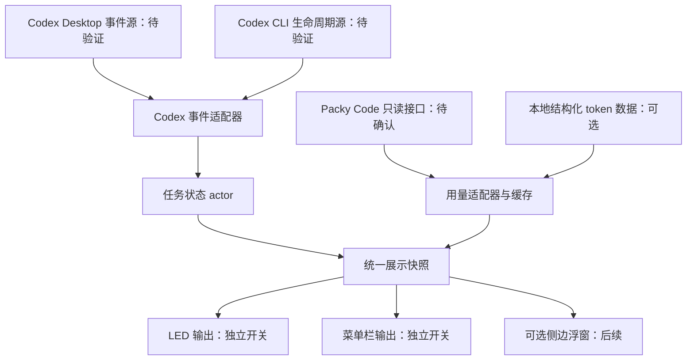

# 实现方案（已确认，历史规划）

2026-09-18 更新：用户已确认并开始实现，当前已生成 0.1.0 本地预览应用。下文保留规划时的目标与决策，实际实现范围、验证结果和使用方式以根目录 README.md 为准。

评审版本：v0.2，2026-09-17。服务名称已修正为 Packy Code，官方文档入口由用户确认：https://docs.packyapi.ai/ 。由于本次公开页面访问仍被自动审批服务 503 阻断，具体 API 和 Codex 生命周期事件名称尚待核验。本文的内部模型及技术选型属于设计建议。

补充阅读：[接入契约](packy-integration.md)、[Review 与决策清单](review.md)。

## 目标与产品范围

一个 macOS 后台应用，提供两个可独立开关的输出：

- Caps Lock LED：只显示任务聚合状态。
- 顶部菜单栏：显示用量／余额摘要，点击查看项目、任务与异常原因。

支持仅 LED、仅菜单栏、两者同时启用。设置面板始终可通过重新打开应用访问，避免隐藏菜单栏后无法找回设置。两者均关闭时可暂停监控。

第一版“项目状态”指 Codex 任务状态，按工作目录／项目聚合，不包含网站探活、任意服务器、构建流水线或 git 工作区分析。若用户所说的运行项目状态还包含这些内容，应单独增加监控适配器。

## 界面建议

优先做系统顶部菜单栏。它适合持续可见的简短信息，不需要一直占用屏幕边缘。第二阶段可增加可拖动并吸附屏幕侧边的窄浮窗；不假设 macOS 有可直接注入的通用系统侧边栏。

菜单栏示例（仅示意，不是真实账户数据）：

```text
● 2  |  已用 38%  |  ¥126.40
```

空间不足时提供“余额 / 百分比 / 任务数 / 紧凑图标”选择。展开面板包括：

1. Packy Code：余额、周期已用／总额度、重置时间、最近成功刷新时间。
2. 任务：项目名、任务名、运行／重试／待审批／待输入／已完成／异常、最后更新。
3. 异常详情：说明是哪一个任务需要处理；观察断线必须区别于任务失败。
4. 操作：手动刷新、打开对应任务或项目（仅使用已验证支持的跳转方式）、设置。

观察器不代替用户审批，也不通过此工具改变 Codex 审批策略。

## 技术栈建议

| 层 | 推荐技术 | 原因／取舍 |
| --- | --- | --- |
| 应用与菜单栏 | Swift + SwiftUI，必要处使用 AppKit | 原生菜单栏、设置窗口、系统生命周期；适合仅 macOS 的范围 |
| 并发与状态 | Swift Concurrency + 单一状态 actor | 串行处理每个任务的事件，减少审批解决与完成事件之间的竞态 |
| LED | 隔离的驱动适配层，优先研究 IOKit／HID 直接输出；必要时小型 C 桥接 | 目标是只写 LED，不发送键盘事件；具体 API 须先实机验证 |
| 本地采集通信 | 已验证 hook 的短命命令入口 + 用户私有 Unix socket | hook 只负责投递，不长时间阻塞任务；同时核验来源权限与连接存活 |
| 余额查询 | URLSession + Packy Code 专用适配器 | 将供应商接口变化与界面隔离 |
| 凭据 | macOS Keychain | 不将密钥放入仓库、配置文件或调试日志 |
| 配置与缓存 | UserDefaults + Application Support 中的最小缓存 | 第一版不需要数据库；只保留必要状态和用量摘要 |
| 验证 | XCTest 或 Swift Testing + 事件回放 | 核心状态转换可不连接真实键盘、不调用付费推理接口进行验证 |

目前不锁定最低 macOS 版本，先结合用户系统、所选硬件接口与部署方式决定。第一版可本地构建；签名、公证、自动更新属于分发阶段。

相较 Tauri，Swift 减少了前端与 Rust 原生桥接两套维护面；Tauri 更适合后续明确需要跨平台的情况。脚本型菜单栏方案适合快速展示数值，但持续事件处理和稳定 LED 驱动仍需要常驻组件，因此暂不作为主要实现。

## 架构



推荐一套常驻宿主承载采集与状态，两个输出订阅同一快照。仅 LED 模式仍运行宿主，但不显示菜单栏图标。除非 LED 权限和崩溃隔离确实需要，不提前增加特权 daemon 或系统扩展。

保证范围：此结构可以在宿主仍存活时检测观察连接断开并闪灯；不能保证宿主自身崩溃后还能闪灯。若要覆盖整个应用崩溃，需单独常驻的 LED 守护进程接收状态与心跳，并设计正常退出／异常失联的区分。这是额外范围，第一版暂不承诺。

## Codex 接入策略

1. 先核验官方 hooks 的覆盖范围，并让 Desktop／CLI 共用事件归一化格式。
2. 若 hooks 不完整，评估官方 app-server 或其他已文档化观察入口；必须实证能观察用户正在使用的 Desktop 实例。
3. 本地结构化日志只作明确标注的兼容方案：固定支持版本、增量读取、处理轮转和截断；不扫描整段聊天推断状态。
4. 若无法可靠捕获审批请求及解决，暂不宣称完成用户要求，也不把一个只能观察自己启动的 CLI 的实现包装成 Desktop 支持。

下述是内部模型，不是声称 Codex 已提供的接口：

`sourceID / sessionID / taskID / turnID / requestID / sequence / eventKind / observedAt`

按源去重、按任务串行应用事件；一个 hook 与一个观察流同时报告同一事件时不能产生两个任务。启动先同步当前快照再消费增量；无法同步时显示未知，不把上次保存的 working 当成当前事实。

快照与增量之间需要水位线或等价的一致性机制：先订阅并缓冲，再读取快照，应用快照之后的增量。若上游缺少可比较的序号／时间边界，必须明确采用的重同步策略及精度限制，不能声称绝不丢事件。每次观察连接重建生成新的连接代次，忽略已失效连接的迟到回调。

单次 hook 命令退出是正常行为，不是观察器断线。必须区分“事件投递入口”和“持续观察连接”；仅靠 start/end hook 不能证明中间链路一直健康。

如果只剩“未知”任务，且没有先前工作中断线的证据，菜单栏显示未知，LED 暂不点亮；不把未知归为已完成，也不以旧缓存启动闪灯。已知工作中失联则按 observerLost 快闪，直到重同步证明状态已恢复或任务已结束。

## 状态与 LED 规则

| 内部状态 | 进入依据 | LED |
| --- | --- | --- |
| working | 明确开始／继续事件、自动批准后仍执行 | 常亮 |
| retrying | 明确可重试错误或重试事件，任务尚未终止 | 常亮 |
| awaitingApproval | 结构化、尚未解决的审批请求 | 快闪 |
| awaitingInput | 结构化、尚未解决的用户输入请求 | 快闪 |
| interrupted | 明确终止事件，原因为额度、网络、权限等 | 快闪 |
| observerLost | 观察连接实际中断，且此前存在进行中的任务 | 快闪 |
| finished / idle | 明确结束，或已同步确认没有活动任务 | 关闭 |

快闪初始建议为每 250 ms 翻转一次，即每秒 2 个完整亮灭周期。这个值是产品建议，后续允许调整。

聚合：任意未解决 attention → 快闪；否则任意 working/retrying → 常亮；否则关闭。

边界处理：

- 每个任务保存 pending request 集合，而不是单一 approval 布尔值。解决一个请求不应清掉另外一个等待。
- 审批解决立即重算：任务继续且无其他 attention 时恢复常亮；若拒绝导致任务结束则关闭；若其他任务仍待处理则继续快闪。
- 自动批准不产生可见快闪；只在事件明确请求用户介入时加入等待集合。
- 普通回复中出现“reply approve”“请确认”等字样不改变状态。
- 重试期间保持常亮。不能看到 HTTP 429、超时或一句报错就认定配额耗尽／任务终止；需要终态或权威额度事实。
- 不以“长时间没有 token 输出”判断断线。使用连接关闭、健康检查失败等信号；heartbeat 只证明观察链路健康，不能伪装为任务事件。
- 工作中观察器断线时保留未知任务与 attention；恢复后同步快照再消除提示。空闲时断线只显示数据不可用，不触发 LED 快闪。
- 终止异常保留待查看记录；建议用户确认已知晓后清除 attention。确认不等于任务恢复。重启新 turn、明确成功或删除任务也应按定义清理旧异常，防止永久快闪。
- 用户主动取消的任务默认归为结束；任务权限终止与用户拒绝审批应区分原因。
- 只有尚未解决的错误才能压过其他正常任务；历史异常不应永远使 LED 闪烁。

普通命令退出非零或一次工具权限被拒绝，并不必然终止整个 Codex turn；如果代理继续修复／重试，应保持常亮。实现时以任务层状态为准，而不是将每次工具错误升级为全局 attention。

实现验收建议：从本地收到有效审批解决事件起，到更新 LED 目标状态，正常负载下不超过 250 ms；与供应商的 60 秒刷新无关。该指标不包含上游尚未投递事件的延迟。

## LED 硬件验证

用户要求只控制灯，因此第一阶段必须验证：

1. 当前 MacBook 内置键盘能否通过独立 LED 输出接口点亮／熄灭。
2. 控灯前后 Caps Lock 逻辑状态、实际输入大小写不变，不使用按键注入、键映射或锁定状态切换。
3. 用户真的按 Caps Lock 时如何与系统 LED 更新协调；退出／关闭 LED 功能时恢复系统当前状态对应的正常灯行为。
4. 睡眠／唤醒、合盖／开盖、系统切换输入法及外接键盘不会写错设备。
5. 权限拒绝时菜单栏仍能正常工作，并明确显示 LED 不可用；不得悄悄用模拟按键作为替代。

活跃控制期间 idle 灯为关闭，这可能与用户真实 Caps Lock 状态不一致，需要在设置中清楚说明。退出后回归系统状态；不承诺进程被强杀时一定能完成清理，实机测试后决定是否需要额外恢复机制。

优先只控制内置键盘，外接设备支持另行测试。不预先承诺不需要任何权限，也不自动申请 root／安装系统扩展。

## 用量、余额与比例

这些量必须分开：

- **供应商真实余额**：来自 Packy Code 权威接口，记录币种、账户范围、更新时间。
- **套餐用量比例**：同一周期的已使用额度 ÷ 总额度，同时显示周期和重置时间。
- **个人预算比例**：周期实际支出 ÷ 用户设定预算，标签必须写“预算”。
- **本地 token 统计／费用估算**：按会话聚合，只显示确实存在的字段；估算单价不能冒充结算价格。

没有总额度或预算时不展示虚假的百分比；分母为 0、不限额、缺失数据分别处理。余额和周期比例可能口径不同，不合并成一个数字。

默认建议 60 秒刷新供应商信息，展开面板时在最小刷新间隔允许下更新；提供手动刷新。遵循服务端限流，失败时退避并保留最后成功值，附带“已过期／更新失败”。一次余额查询失败不能推定 Codex 任务失败；只有对应活动任务的终止状态才触发该类 LED 告警。

多项目共享一个账户时，账户余额不能显示为每个项目独立余额。项目成本只有在日志或 API 存在可靠归属字段时才显示，否则标记为无法归属。

若个人预算分子来自本地估算，则明确改为“估算预算使用率”，不称为实际支出。预付账户没有总额上限时，默认直接显示余额；不能用累计充值额替代套餐额度。Packy Code 具体字段映射、认证与失败处理见独立接入契约。

## 配置、隐私与资源占用

- 两个输出开关之外，支持选择菜单栏主指标、刷新间隔、关注项目、闪烁频率和是否开机启动。启动项默认关闭。
- 设置中说明 LED 使用状态灯语义，真实 Caps Lock 功能仍可操作；初次启用后可在用户确认实现阶段进行硬件自检。
- 不收集提示词和代码内容，只处理任务标识、结构化状态与用量必要字段；诊断日志默认不记录完整事件 payload。
- hook 安装只在实现阶段执行：保留已有配置，避免覆盖其他 hook，提供可回退／卸载方式；仅支持已验证版本和配置格式。
- 单实例持有 LED 输出，避免两个进程争抢设备。只在目标变化时更新常亮／关闭状态，快闪才启用定时器；关闭 LED 输出即停止定时器并恢复系统灯状态。
- 实际能耗、常驻内存与睡眠恢复开销应在目标 MacBook 上测量，当前不虚构性能数字。

## 实施阶段与交付门槛

| 阶段 | 工作 | 验收／退出条件 |
| --- | --- | --- |
| 0：完成研究 | 阅读候选仓库、许可证、Codex 官方接口与 Packy Code 文档 | 形成带源码链接的比较，确认事件覆盖及账单口径；用户确认方案后才开始实现 |
| 1：可行性验证 | 最小 LED 硬件试验、Desktop 结构化事件观察、Packy Code 只读查询 | 三项各自给出成功证据或具体限制；任何关键项不成立先调整方案，不开展完整 UI |
| 2：核心状态 | 事件归一化、pending request、并发任务聚合、重连同步、独立输出开关 | 事件回放验证关键状态，重复／乱序／过时事件不错误覆盖新状态 |
| 3：菜单栏与用量 | 状态列表、供应商余额、真实比例／预算区别、Keychain、刷新与过期显示 | 用量与供应商口径一致；失败不伪造 0；仅菜单栏模式完整可用 |
| 4：LED 集成 | 接入状态机、常亮／快闪／关闭、恢复、仅 LED 模式 | 审批解决及时更新、重试不误闪、输入逻辑不变 |
| 5：分发与扩展 | 设置、启动项、文档、签名／公证；按需要追加侧边浮窗 | 本地可安装／退出／卸载；多显示方式选择可恢复 |

第一版验收矩阵至少覆盖：两个任务注意力优先；同任务多个审批；审批解决但仍有输入请求；自动批准；临时重试成功；重试耗尽；真实额度耗尽；权限终止；工作中断线及重连；空闲断线；用户取消；睡眠恢复；供应商数据过期；仅 LED／仅菜单栏／两者同时开启。

## 等待确认的事项

- 是否接受 Swift 原生应用、顶部菜单栏优先、侧边浮窗后续的方向？
- Packy Code 官方文档地址已确认；待核验具体用量／余额接口，无需再次确认服务名称。
- “项目状态”是否只指 Codex 任务，还是还要包括本地开发服务器／构建进程？

以上为规划阶段的确认清单。当前已经实现本地预览版；没有自动安装 Codex hook，外部接口与硬件适配仍按 README 列出的范围继续验证。
